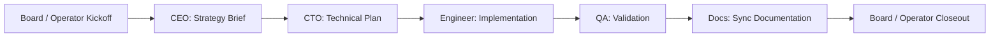

# CEO -> CTO -> Engineer -> QA -> Docs Sample Playbook

Status: Proposed example
Date: 2026-03-23
Audience: Product and engineering
Related:
- `doc/plans/2026-03-23-agent-role-template-and-playbook-framework.md`
- `doc/plans/2026-02-19-ceo-agent-creation-and-hiring.md`
- `doc/plans/2026-03-13-agent-evals-framework.md`
- `doc/plans/2026-03-13-workspace-product-model-and-work-product.md`
- `doc/plans/2026-03-14-skills-ui-product-plan.md`
- `docs/agents-runtime.md`

## 1. Purpose

This document shows how the role-template and playbook framework should look in
one concrete Paperclip workflow:

- CEO
- CTO
- Engineer
- QA
- Docs

The goal is not to bless one universal company structure.
The goal is to give Paperclip a realistic sample that:

- exercises the core object model
- maps cleanly onto existing Paperclip primitives
- is detailed enough to drive schema, API, UI, and eval work

## 2. Scenario

This playbook represents a common engineering company loop:

> take an approved product goal, translate it into strategy, turn it into a
> technical plan, implement it, validate it, and sync documentation before
> calling it complete.

This is intentionally a board-facing, control-plane workflow.
It is not trying to replace git, CI, or a browser automation tool.
It governs how the company uses those things.

## 3. What This Playbook Optimizes For

1. **Board clarity**
   The board should be able to understand where the work is and what is blocked.

2. **Explicit handoffs**
   Each role should leave downstream evidence instead of forcing the next role
   to rediscover context.

3. **Output-first execution**
   Each stage must produce work products that prove progress.

4. **Governed autonomy**
   Agents can operate automatically inside clear authority and budget rules.

5. **Progressive disclosure**
   Top-level summary first, structured evidence second, raw logs third.

## 4. Participating Role Templates

## 4.1 CEO role

Mission:

- translate board intent into an execution brief
- define scope and success criteria
- decide whether the work is worth doing now
- request approval when staffing or budget changes are needed

Default authority:

- may create and reprioritize issues
- may draft hires
- may propose strategic plan changes
- may not bypass board approval for governed actions

Default capabilities:

- planning and synthesis
- company context access
- issue management
- approval drafting

## 4.2 CTO role

Mission:

- convert strategy into a technical execution plan
- define architecture, risks, workspace policy, and validation plan
- break the work into implementable issues

Default authority:

- may create child issues and assign them
- may choose execution workspace strategy
- may request additional engineering capacity
- may not mark implementation complete without engineer outputs

Default capabilities:

- repo and workspace inspection
- architecture planning
- issue decomposition
- test-plan authoring

## 4.3 Engineer role

Mission:

- deliver the scoped implementation
- keep work grounded to the assigned issue and technical plan
- produce concrete code and operator-readable implementation evidence

Default authority:

- may edit code and create work products
- may not merge, deploy, or change budget policies
- may create follow-up issues when blocked or when risks are discovered

Default capabilities:

- local coding workspace access
- repo write access
- test execution
- diff and artifact generation

## 4.4 QA role

Mission:

- validate behavior against acceptance criteria
- surface blockers clearly with evidence
- certify pass only when the evidence actually exists

Default authority:

- may create blocker issues
- may move issues into blocked or back to in-progress with rationale
- may not ship or change product scope

Default capabilities:

- browser execution
- screenshot capture
- console/network inspection
- structured bug reporting

## 4.5 Docs role

Mission:

- synchronize external and internal documentation to match what shipped
- turn implementation and QA evidence into human-facing documentation

Default authority:

- may edit docs and release notes
- may request clarification from engineer or QA
- may not approve incomplete implementation by itself

Default capabilities:

- docs editing
- release note generation
- screenshot and link embedding
- diff summarization

## 5. Trigger And Success Conditions

## 5.1 Trigger

This playbook should start when:

- the board or operator creates or approves a product initiative
- the initiative is attached to a company, goal, and optionally a project
- a responsible CEO and CTO exist in the same company

Optional V1.1 trigger modes:

- manual start from a project or goal
- manual start from a parent issue

## 5.2 Success

The workflow is complete when all are true:

- the CEO strategy brief exists
- the CTO technical plan exists
- the implementation issue is completed with concrete outputs
- QA produced a pass result or explicitly recorded accepted exceptions
- docs were updated to match the actual delivered behavior
- the board-visible summary on the root issue is complete

## 6. Required Work Products

This playbook should require these work product kinds.

### 6.1 Strategy brief

Produced by CEO.

Must contain:

- business goal
- why now
- scope in
- scope out
- success criteria
- budget or staffing concerns

### 6.2 Technical plan

Produced by CTO.

Must contain:

- architecture summary
- chosen workspace strategy
- implementation breakdown
- test plan
- main risks and mitigations

### 6.3 Implementation bundle

Produced by Engineer.

Must contain:

- branch, commit, or PR reference
- preview URL if available
- implementation summary
- test evidence
- known limitations or follow-ups

### 6.4 QA report

Produced by QA.

Must contain:

- pass or fail
- environments tested
- scenarios executed
- screenshots or logs for failures
- blocker issue links if any

### 6.5 Docs bundle

Produced by Docs.

Must contain:

- updated docs or release note links
- user-visible behavior summary
- caveats or migration notes

## 7. Playbook Shape



V1.1 does not need a general workflow engine to support this.
It can materialize this as a root issue with staged child issues.

## 8. Detailed Stage Design

## 8.1 Stage 0: Board or operator kickoff

Owner:

- human board operator

Inputs:

- company goal
- problem statement
- rough desired outcome
- budget context

Actions:

- create or select the parent project
- start the playbook
- bind concrete agents to the required role slots

Outputs:

- root issue representing the workflow run
- role bindings for CEO, CTO, Engineer, QA, and Docs

Exit criteria:

- stage bindings are valid
- CEO step is ready to begin

## 8.2 Stage 1: CEO strategy brief

Owner:

- CEO role

Entry criteria:

- root issue exists
- the initiative has a clear goal and project context

Consumed inputs:

- goal
- project
- recent company priorities
- budget and staffing state

Required actions:

- frame the initiative in business terms
- define scope boundaries
- define success criteria
- identify whether new approvals are needed
- write the strategy brief work product

Required outputs:

- strategy brief
- structured issue comment with:
  - problem
  - objective
  - scope in
  - scope out
  - success criteria
  - escalation needs

Exit criteria:

- strategy brief exists
- the brief is readable by a human without opening raw logs
- CTO has enough information to plan without re-asking basic scope questions

Escalations:

- if new hiring is required, create or attach a hire approval request
- if scope implies a budget jump, request board review before CTO planning

UI expectations:

- top layer: one-paragraph initiative summary
- middle layer: scope checklist and approval status
- bottom layer: raw reasoning trace

## 8.3 Stage 2: CTO technical plan

Owner:

- CTO role

Entry criteria:

- CEO stage is complete
- strategy brief exists

Consumed inputs:

- strategy brief
- workspace configuration
- project context
- known architecture constraints

Required actions:

- define technical approach
- choose or confirm execution workspace strategy
- break down the work
- identify risks
- define validation approach
- create engineer, QA, and docs child issues if they do not already exist

Required outputs:

- technical plan
- issue breakdown
- test plan summary
- workspace choice and rationale

Exit criteria:

- implementation issue is actionable
- QA knows what needs to be validated later
- docs knows which surfaces will likely change

Escalations:

- if the workspace strategy is missing or invalid, block before implementation
- if additional engineering capacity is required, request staffing action

UI expectations:

- top layer: technical plan headline and risk level
- middle layer: architecture summary, issue list, test checklist
- bottom layer: raw repo/workspace inspection notes

## 8.4 Stage 3: Engineer implementation

Owner:

- Engineer role

Entry criteria:

- CTO stage is complete
- engineer has assigned implementation issue
- execution workspace is ready

Consumed inputs:

- technical plan
- child issue
- workspace policy
- acceptance criteria

Required actions:

- implement the scoped work
- run relevant tests
- keep issue status and comment trail current
- produce implementation bundle

Required outputs:

- code change reference
- preview or runtime artifact if applicable
- implementation summary
- test evidence
- explicit known limitations

Exit criteria:

- implementation issue is moved to `in_review`
- QA has enough concrete evidence to validate

Escalations:

- if blocked by missing requirements, comment and reassign or escalate to CTO
- if implementation changes scope, escalate before continuing

UI expectations:

- top layer: what was changed
- middle layer: checklist, tests, preview, PR/diff link
- bottom layer: raw command logs and traces

## 8.5 Stage 4: QA validation

Owner:

- QA role

Entry criteria:

- implementation issue is in review
- implementation bundle exists
- preview URL or equivalent test target exists when relevant

Consumed inputs:

- implementation bundle
- test plan
- acceptance criteria
- root issue context

Required actions:

- verify the shipped behavior against the stated plan
- capture evidence
- create blocker issues for failures
- report pass/fail clearly

Required outputs:

- QA report
- screenshots, logs, and blocker links as needed
- structured summary with tested flows and outcome

Exit criteria:

- if pass: docs stage can begin
- if fail: engineer stage is reopened with clear evidence

Escalations:

- if auth, browser, or environment access is missing, mark blocked instead of
  pretending to validate

UI expectations:

- top layer: pass/fail
- middle layer: scenarios tested, evidence checklist, blocker links
- bottom layer: raw browser logs and screenshots

## 8.6 Stage 5: Docs synchronization

Owner:

- Docs role

Entry criteria:

- QA passed or passed with accepted exceptions
- implementation bundle exists

Consumed inputs:

- implementation summary
- QA report
- changed files or behavior summary

Required actions:

- update relevant docs
- write release note or operator-facing summary
- record caveats and migration notes

Required outputs:

- docs bundle
- structured summary of user-visible changes

Exit criteria:

- documentation reflects actual delivered behavior
- root issue has final board-visible summary fields

Escalations:

- if implementation behavior is unclear, request clarification instead of making
  things up

UI expectations:

- top layer: what users/operators should know
- middle layer: changed docs and release notes
- bottom layer: raw editing diff or transcript

## 8.7 Stage 6: Board or operator closeout

Owner:

- human board operator or CEO

Purpose:

- confirm all required outputs exist
- mark the root issue done
- capture follow-up work if needed

This stage can remain manual in V1.1.

## 9. Handoff Contracts

The handoff design is the most important part of this playbook.

## 9.1 CEO -> CTO

Required handoff fields:

- objective
- why now
- scope in
- scope out
- success criteria
- budget/staffing concerns

What CTO may assume:

- the work is strategically approved to plan
- scope boundaries are real until changed explicitly

What CTO may not assume:

- technical feasibility has already been proven
- staffing is unlimited

## 9.2 CTO -> Engineer

Required handoff fields:

- technical plan
- chosen workspace strategy
- implementation issue
- validation plan
- main risks

What Engineer may assume:

- the issue is implementation-ready
- the workspace policy is valid

What Engineer may not assume:

- scope may be expanded silently
- QA will infer intended behavior without explicit notes

## 9.3 Engineer -> QA

Required handoff fields:

- implementation summary
- how to test
- preview/PR/diff reference
- test evidence
- known limitations

What QA may assume:

- the implementation is in a state worth validating

What QA may not assume:

- undefined behavior is acceptable
- missing preview access means pass by default

## 9.4 QA -> Docs

Required handoff fields:

- pass/fail
- tested scenarios
- known caveats
- final user-visible behavior

What Docs may assume:

- behavior summary is grounded in tested reality

What Docs may not assume:

- internal code comments are sufficient documentation

## 10. Issue Tree Representation

One V1.1 representation should be:

Parent issue:

- `Ship feature: <name>`

Child issues:

- `CEO brief: <name>`
- `CTO plan: <name>`
- `Engineer implementation: <name>`
- `QA validation: <name>`
- `Docs sync: <name>`

Suggested metadata on each child issue:

- `workflow_playbook_id`
- `workflow_playbook_version_id`
- `workflow_root_issue_id`
- `workflow_step_key`
- `required_output_contract`

Suggested status progression:

- CEO child starts in `todo`
- downstream children start in `backlog`
- each downstream child moves forward only when the prior stage is complete

## 11. Role Binding Example

Example playbook bindings:

```yaml
bindings:
  ceo:
    roleTemplate: executive-ceo-strategy
  cto:
    roleTemplate: engineering-cto-planner
  engineer:
    roleTemplate: software-engineer-implementer
  qa:
    roleTemplate: qa-validation-lead
  docs:
    roleTemplate: docs-release-writer
```

These are role slots, not hardcoded agent IDs.
At runtime the company binds them to concrete agents.

## 12. Capability Guidance By Role

## 12.1 CEO

Should usually have:

- company-wide read access
- issue and approval write access
- no broad repo write access by default

## 12.2 CTO

Should usually have:

- planning-level workspace inspection
- issue creation and assignment
- architecture and risk documentation powers

## 12.3 Engineer

Should usually have:

- repo and workspace write access
- test execution
- limited secret scopes relevant to implementation

## 12.4 QA

Should usually have:

- browser and screenshot capability
- console/network access
- blocker issue creation
- no merge or deploy power

## 12.5 Docs

Should usually have:

- docs repo or docs directory write access
- release note generation capability
- read access to implementation and QA outputs

## 13. Progressive Disclosure Requirements

Every stage in this playbook should produce output in three layers.

### 13.1 Top layer

One short operator-facing summary:

- what happened
- whether the stage passed
- what needs attention now

### 13.2 Middle layer

Structured evidence:

- checklists
- work products
- links
- screenshots
- blocker references

### 13.3 Bottom layer

Raw trace:

- logs
- command output
- browser traces
- full agent transcript when available

The board should rarely need the bottom layer, but it must remain reachable.

## 14. Evaluation Cases

This sample playbook should ship with eval cases that prove the design works.

## 14.1 Deterministic checks

- CEO stage creates a strategy brief before CTO planning starts
- CTO stage cannot complete without a technical plan and implementation issue
- Engineer stage cannot move to review without implementation evidence
- QA cannot pass without a QA report
- Docs cannot complete without docs bundle

## 14.2 Scenario evals

- happy path feature delivery
- blocked engineering due to missing workspace
- QA fails and reopens implementation
- docs stage requests clarification because implementation summary is ambiguous
- CEO requests approval because scope expansion changes staffing needs

## 14.3 Efficiency checks

- average heartbeats per stage
- average cost per successful workflow
- full-thread reload rate
- ratio of successful runs with complete outputs

## 15. Why This Example Matters

This playbook is useful because it exercises almost every core Paperclip
concern:

- org structure
- role authority
- issue hierarchy
- approvals
- work products
- workspaces
- browser-backed QA
- documentation closeout
- board-facing visibility

If Paperclip can represent this flow cleanly, it is on the right path toward
representing an autonomous company rather than a loose collection of agents.

